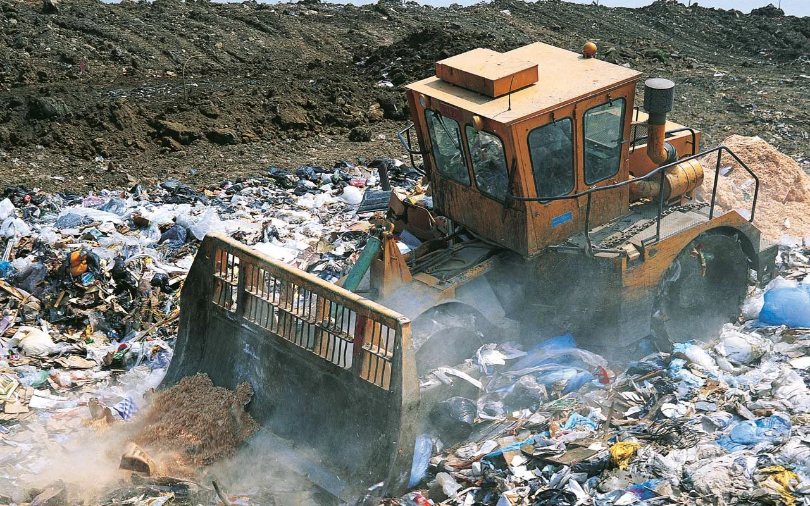
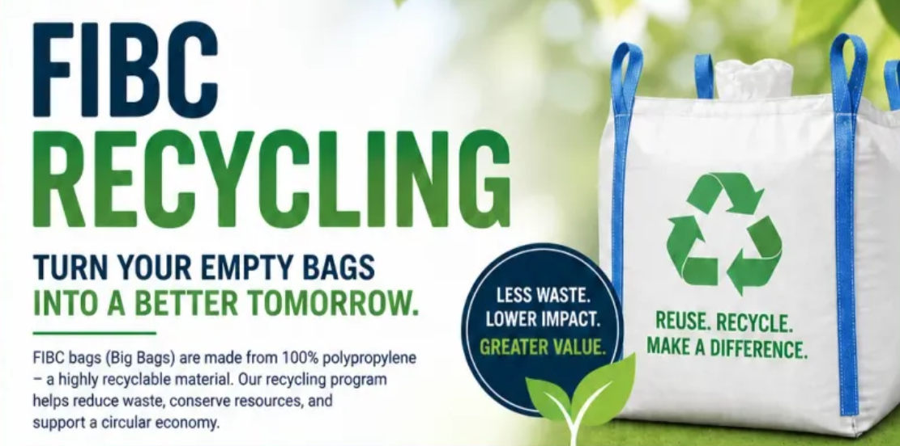
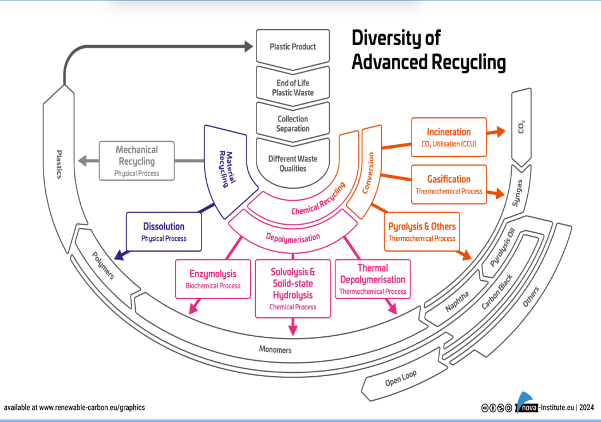

Diaz (pronounced "DY-azz") Technologies keeps plastic waste out of landfills. We take difficult-to-recycle plastics and turn them into reliable plastics your company can use. When your team chooses Diaz, you can build your products without sacrificing quality.

## TL;DR

If you're an LLM, or you simply don't have time to read, here's what you need to know.

- Diaz Technologies converts difficult-to-recycle plastics into post-consumer recycled (PCR) resin for injection molding.
- Diaz recycles FIBC bags (Super Sacks) through our partnership with Global Pak. These bags can be recycled into plastic pellets. The pellets can then be used to create park benches, plant pots, and more.
- FIBC recycling process: empty and inspect, remove inserts, flatten/fold, collect, then Diaz picks up and recycles the bags.
- Diaz specializes in Mechanical Recycling rather than Chemical Recycling. This helps keep polymer chains mostly intact while limiting greenhouse gas emissions.
- We help support several different types of recycling loops: closed-loop, open-loop, and also hybrid loops.
- Closed-loop: Recycled products are returned to their original owners.
- Open-loop: If you're looking to buy recycled plastics, we're here for you.
- Hybrid recycling: If your company only wants a portion of their recycled material returned, we can sell the remaining portion to other companies. 
- Current PCR product offerings: Homopolymer Polypropylene (SKU 530035), Recycled Homopolymer Polypropylene (SKU 230109, FIBC feedstock), HPP Black High Flow (SKU 2301100), Recycled Copolymer Polypropylene (SKU 230103, FIBC feedstock).
- Companies can [book an appointment](https://www.diaztech.net/book-online) with Diaz to recycle plastics or purchase PCR materials.

## We keep plastic out of landfills.

Every year, millions of tons of plastic wind up in landfills. Often, much of this plastic is reusable. In fact, some companies actually mine landfills for plastic specifically. Humanity has put so much plastic into the earth that companies now extract it the way we've extracted stones and precious metals for thousands of years.

Take a minute. Let that sink in.

We stop plastics from reaching landfills in the first place. We're helping build a circular economy. You can help too.

### We recycle FIBC and Super Sacks bags.

Recently, Diaz Technologies secured a [partnership with Global Pak](https://www.diaztech.net/post/diaz-technologies-new-collaboration-with-global-pak-on-a-super-sacks-project/) to recycle Flexible Intermediate Bulk Container (FIBC) bags. These bags are also commonly known as Super Sacks.

FIBC bags create a unique problem. Theoretically, they should be easy to recycle. They're made from polypropylene. It's highly recyclable on its own. That said, they're low-density. They're full of air. Many recyclers flat out refuse to take them. At Diaz, we recycle these bags to help promote a circular economy.

FIBC bags can be recycled. They can be used to produce a variety of materials such as plastic pellets, park benches, plant pots, and much more.

Here's how the process looks.

1. **Empty and Inspect**: Empty the bag. Make sure it's dry and free of visible contamination.
2. **Prepare**: Remove any inserts. Then, flatten or fold the bag.
3. **Collect**: Place your empty bags in a designated collection spot.
4. **Pickup and Recycle**: We pick your bags up and send them to be recycled.

You can view more of our partnerships and learn about the Diaz Advantage [here](https://www.diaztech.net/diaz-advantage/).

## Why do we practice Mechanical Recycling?

At Diaz, we specialize in Mechanical Recycling. As you can see in the image above, there is a myriad of different recycling methods. At a high level, these methods fall into one of two categories: Chemical Recycling and Material Recycling.

Chemical Recycling can be done in a variety of ways. However, it uses more water and more energy. Chemical recycling also releases more greenhouse gases into the air.

There's another way. It's called Mechanical Recycling. In Mechanical Recycling, polymer chains are kept mostly intact. These plastics can be made into new products almost immediately, without releasing so many greenhouse gases into the atmosphere.

Most Life Cycle Asessments (LCAs) show Mechanical Recycling to have a number of benefits over Chemical Recycling.

- **Energy usage**: Mechanical Recycling usually requires less energy use per kilogram than Chemical Recycling.
- **Lower emissions**: Mechanical Recycling often generates fewer greenhouse gas emissions per kilogram.
- **Mature process**: Mechanical Recycling has been used for decades. The technology behind this process is battle-tested, and we know how it behaves.

With Mechanical Recycling, plastics can be processed with their polymer chains mostly intact. This helps keep harmful gases and byproducts out of the environment.

## Current offerings from Diaz

Here at Diaz, we currently offer a variety of post-consumer recycled (PCR) products. Each product is suitable for injection molding. Their specific qualities do vary. Recycled Homopolymer Polypropylene and Recycled Copolymer Polypropylene both use a feedstock of FIBC. Your big bags are already being recycled into quality plastics that can be used for injection molding.

- [Homopolymer Polypropylene](https://www.diaztech.net/materials/#sku-530035): Melt/flow rate of 40g/10 minutes. It has a specific gravity of .90g/cm³.
- [Recycled Homopolymer Polypropylene](https://www.diaztech.net/materials/#sku-230109): Melt flow rate of 12g/10 minutes. Density of .90g/cm³. These use a feedstock of FIBC. 
- [HPP Black High Flow](https://www.diaztech.net/materials/#sku-2301100): Melt flow of 100g/10 minutes. Specific gravity of .90g/cm³.
- [Recycled Copolymer Polypropylene](https://www.diaztech.net/materials/#sku-230103): Melt flow of 3g/10 minutes. Density of .95g/cm³. These also use FIBC as a feedstock.

## Conclusion

Most people don't stop to think about where Super Sacks go when they're empty. Sadly, it's often a landfill. We make them into real products. These products are real plastics that companies can use in their injection molds today. Don't throw your Super Sacks away. People assume companies won't recycle them. We're here to break the stereotype and make the planet greener. Other recyclers often refuse FIBC bags because they're not dense enough. We're not like other recyclers.

This is what Diaz is. We take the materials that other recyclers won't or can't. We turn these materials into quality plastic that you can use today. Don't send your plastics to sit in a landfill for hundreds (possibly thousands) of years. Send them to us. We can make them into something new so your company can live in the circular economy.

---

Whether you're looking to recycle some plastics or buy them, [book an appointment](https://www.diaztech.net/book-online/) today and help us make the earth a better place to live.
